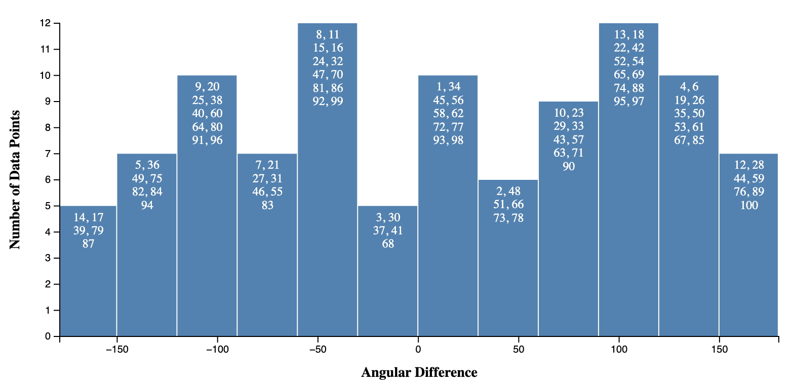
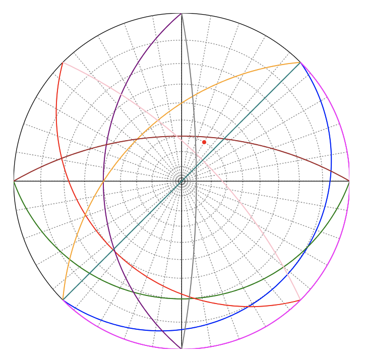
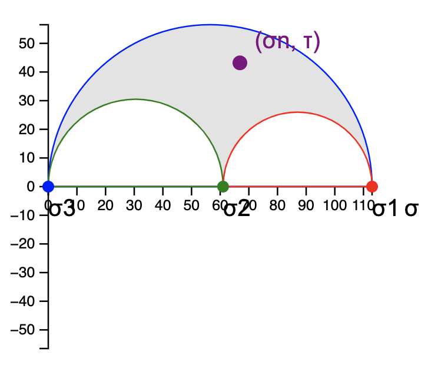
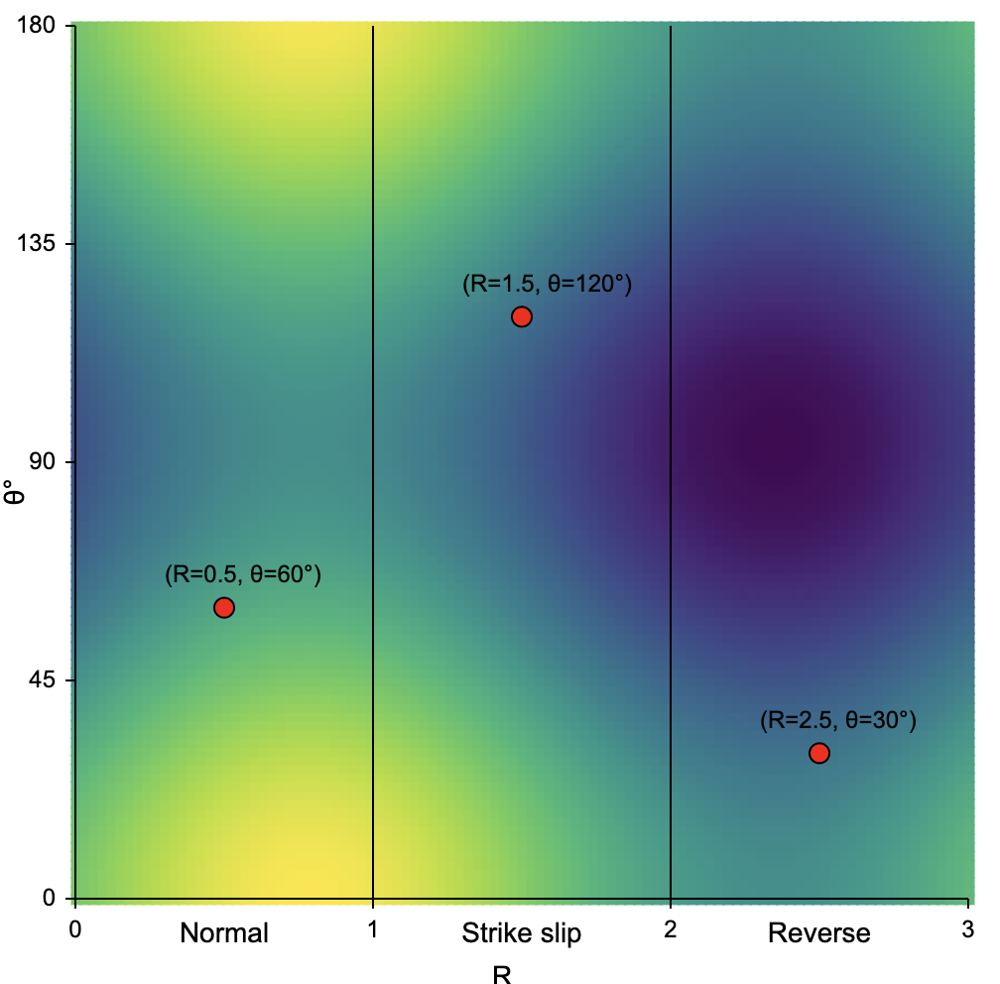
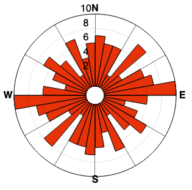
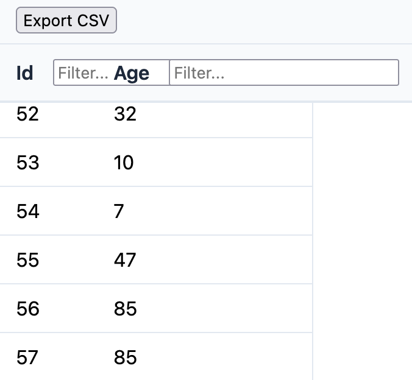
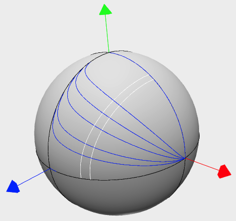

# Geoplot

<center></center>

Plotting tools for geologists based on [d3.js](https://d3js.org/) and [three.js](https://threejs.org/)


## Interactive tools

### 1. Histogram


Launch it with the command
```bash
node run histogram
```

### 2. Wulff stereographic projection


Launch it with the command
```bash
node run wulff
```

### 3. Mohr circle in 3D


Launch it with the command
```bash
node run mohr
```

### 4. Stress domain (Anderson)


Launch it with the command
```bash
node run domain
```

### 5. Rose diagram


Launch it with the command
```bash
node run rose
```

### 6. Table


Launch it with the command
```bash
node run table
```

### 7. Sphere


Launch it with the command
```bash
node run sphere
```
